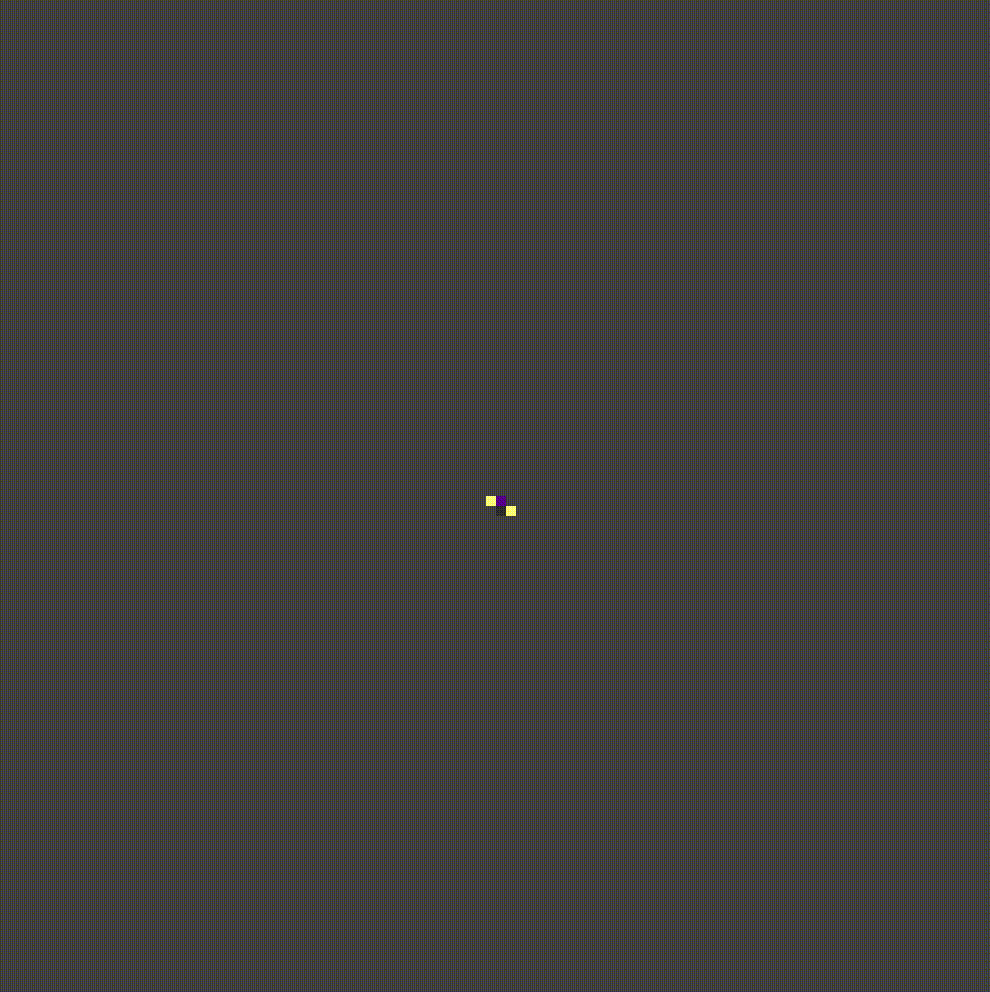

# Fungal Growth Simulation

My take on SSD class project (Symulacja Systemów Dyskretnych [PL]).

This project simulates the growth of fungi using cellular automata. The simulation is visualized using Pygame.



## Project Structure

The project is organized into several Python scripts and modules:

- [`main.py`](main.py): The main script that runs the simulation.
- [`display.py`](display.py): Contains the [`Display`](display.py) class for visualizing the simulation using Pygame.
- [`cell_automa.py`](cell_automa.py): Contains the `CellAutoma` class for the cellular automata simulation.
- [`models/`](models/): Contains various models for the cellular automata.

## How to Run

1. Install the required Python packages:

```sh
pip install pygame numpy lzma
```

2. Run the main script:

```sh
python main.py
```

This will run the simulation and save the frames to a file in the [`log/`](log/) directory.

3. To visualize the simulation, run the display script:

```sh
python display.py
```

This will load the frames from the file and display them using Pygame.

## Controls

While the visualization is running, you can use the following controls:

- `Space`: Pause or resume the simulation.
- `Left Arrow`: Go to the previous frame.
- `Right Arrow`: Go to the next frame.
- `Up Arrow`: Increase the speed of the simulation.
- `Down Arrow`: Decrease the speed of the simulation.
- `Esc` or `q`: Exit the simulation.

## Models

The behavior of the cellular automata is determined by the models in the [`models/`](models/) directory. Each model is a Python script that defines a class extending the `BaseModel` class from [`models/baese_model.py`](models/baese_model.py). The model used for the simulation is specified in the [`MODEL`](main.py) variable in [`main.py`](main.py).

## Output

The frames of the simulation are saved to a file in the [`log/`](log/) directory. The filename is specified in the [`FILENAME`](display.py) variable in [`main.py`](main.py). The frames are saved as numpy arrays, with negative values representing food and positive values representing shroom. The frames can be loaded and visualized using the [`Display`](display.py) class in [`display.py`](display.py).

## Customization

You can customize the simulation by modifying the [`MODEL`](main.py), [`SHAPE`](main.py), and [`FILENAME`](display.py) variables in [`main.py`](main.py), and the [`FILENAME`](display.py) variable in [`display.py`](display.py). You can also create your own models by extending the `BaseModel` class and adding them to the [`models/`](models/) directory.
